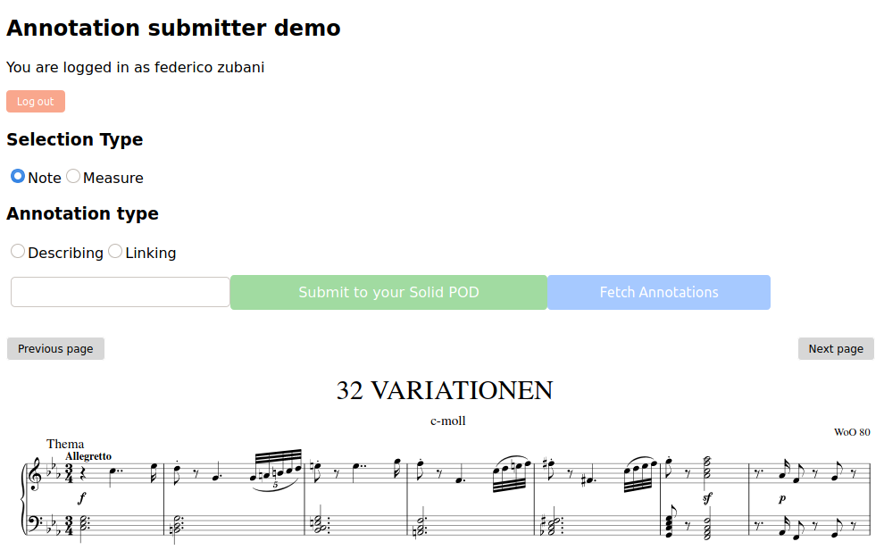

# TROMPA Selectable Score Demo application, the expanded version!



This repository contains a minimal example React application integrating the TROMPA [selectable-score](https://github.com/trompamusic/selectable-score) React component. To run it, clone this repository, then:

```
cd annotation-submitter-demo
npm install
npm start
```

Now point your web browser at https://localhost:8080. Wait a few moments for the solid login prompt, instert your crendentials and then let [Verovio](http://www.verovio.org) render the score.

Click and drag to select MEI elements (in this example, notes); hold down shift or ctrl to select discontinuous regions. The app lets you insert your annotation comments, choose what type of annotation you would like to insert (either a URI link or a plain text comment) and then POST them to your solid pod annotation.

## Known issues

Paging is currently very slow. We're working on improving this, through [MELD](https://github.com/oerc-music/meld) optimisations and potentially by running Verovio as a Web Worker (work in progress!)

Currently the app POSTs annotaion to your public/ solid pod folder. In the near future it will create pertinent folders if they are not present, such as trompa/annotation/mahler or something similar.

## Further reading

For more information on TROMPA see the [TROMPA website](https://trompamusic.eu) and the following paper:

- [DLfM 2019 overview paper on TROMPA](https://dl.acm.org/doi/10.1145/3358664.3358666)

For more information on MELD see the [MELD metarepository](https://github.com/oerc-music/meld) and these papers:

- [ISMIR 2017 paper on distributed annotation of musical score](https://ora.ox.ac.uk/objects/uuid:945287f6-5dd3-4424-940c-b919b8ad2768)

- [DLfM 2018 paper on publishing musicology using MELD](https://dl.acm.org/doi/10.1145/3273024.3273038)

- [DLfM 2019 paper on annotating musicological observations using MELD](https://dl.acm.org/doi/10.1145/3358664.3358669)
